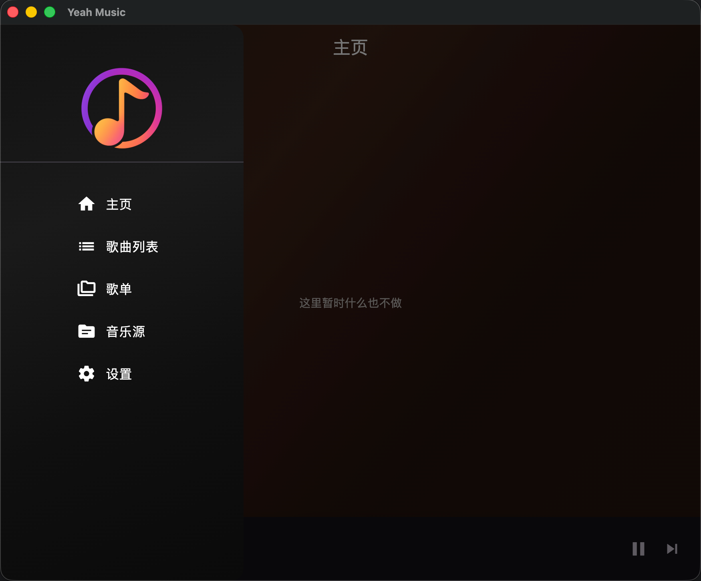
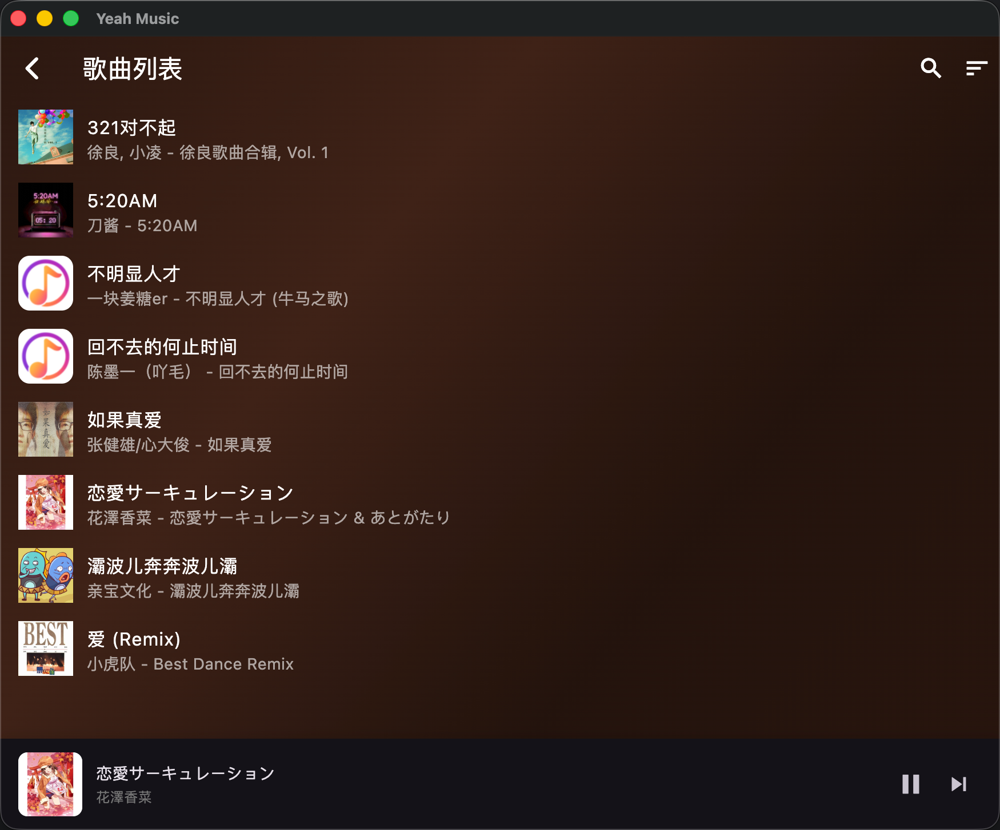
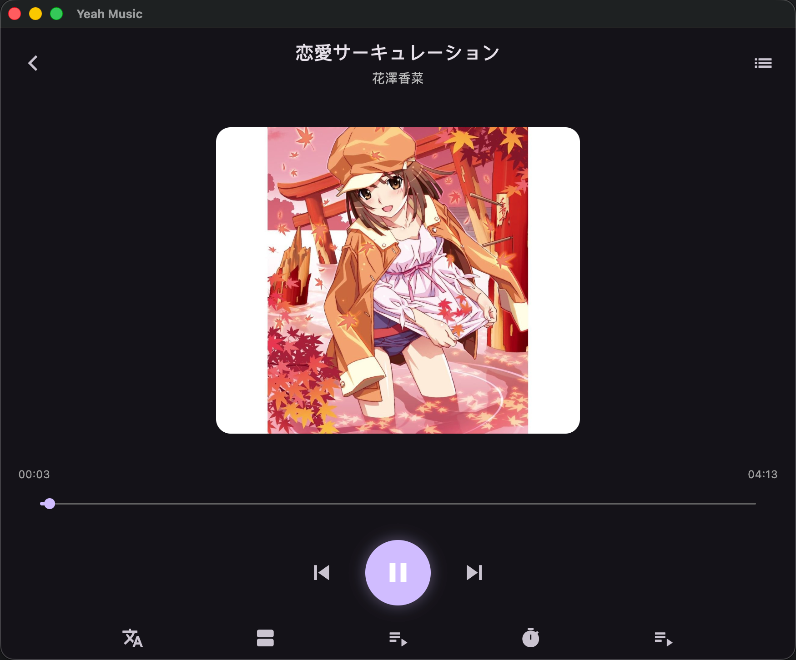
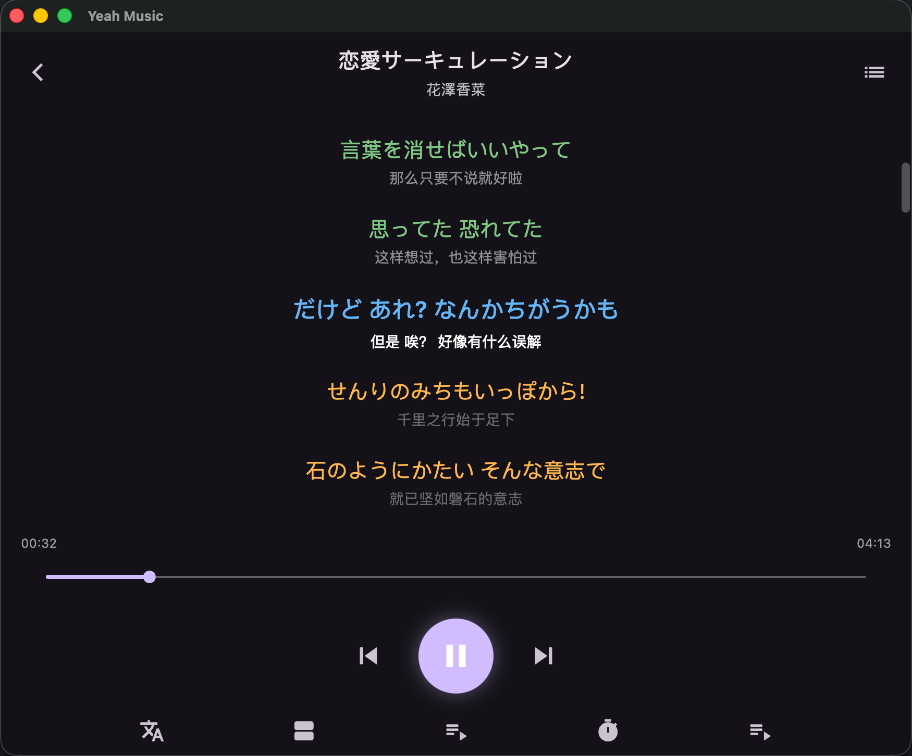
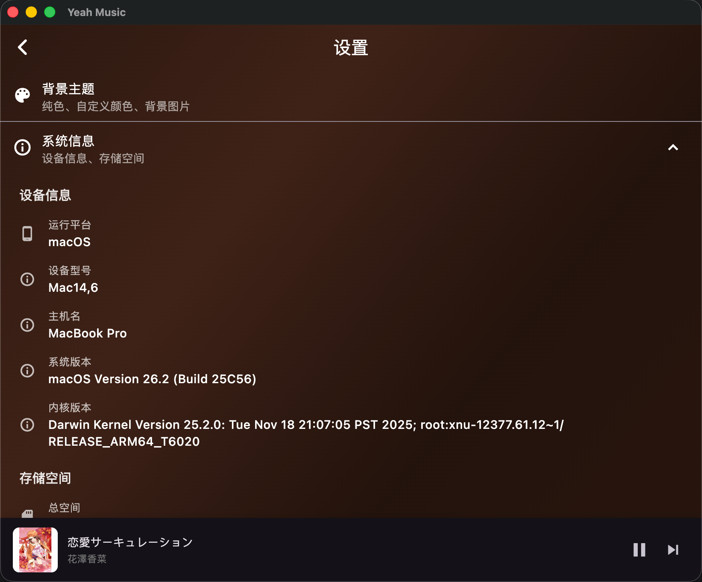

    

简洁、现代化的跨平台音乐播放器

# Yeah Music 🎶

**Yeah Music** 是一个基于 **Flutter** 开发的跨平台音乐应用，  
目标是为用户提供简洁、现代、无缝的音乐体验，支持 **Android / iOS / 桌面** 多平台。

✨ 功能（规划 / 开发中）：
- 🎧 播放本地和在线音乐
- 📂 播放列表与收藏管理
- 🌙 夜间模式
- 🚀 轻量快速，Flutter 驱动
- ☁️ 支持网盘

# 💻 平台支持

- Android
- iOS
- Windows / macOS / Linux（桌面端）

更多功能正在开发中，敬请期待！  

> 初版(先实现功能)。。。

  
 
  
  
