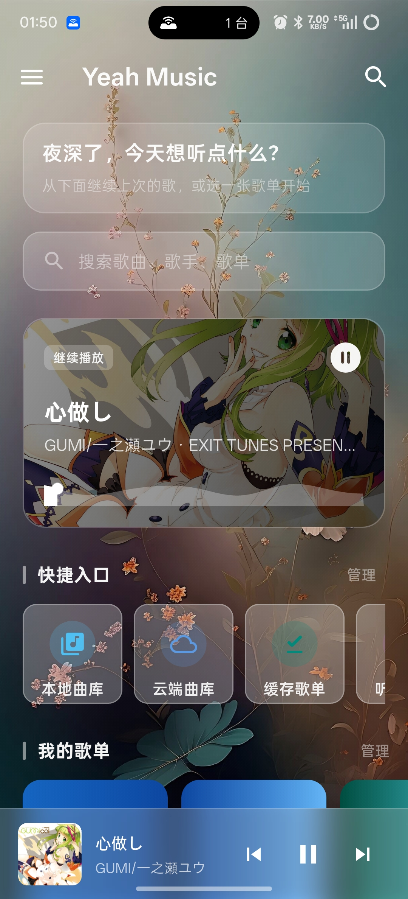
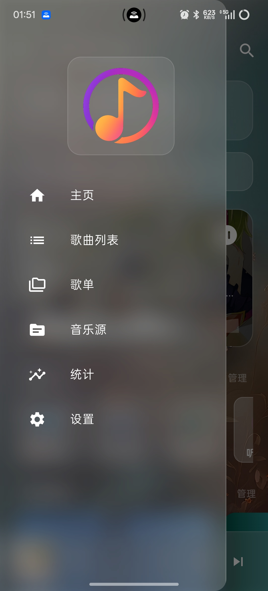
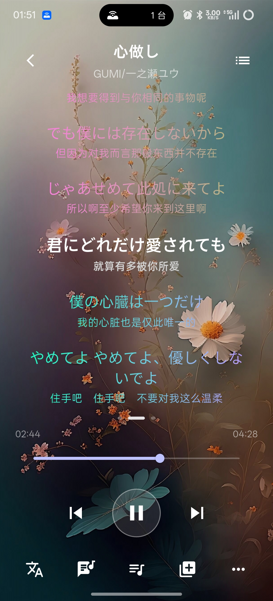
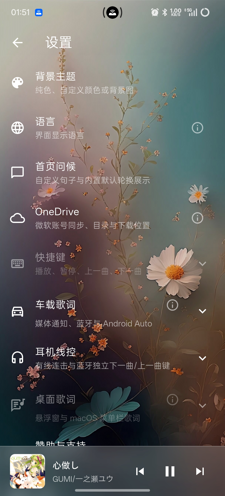
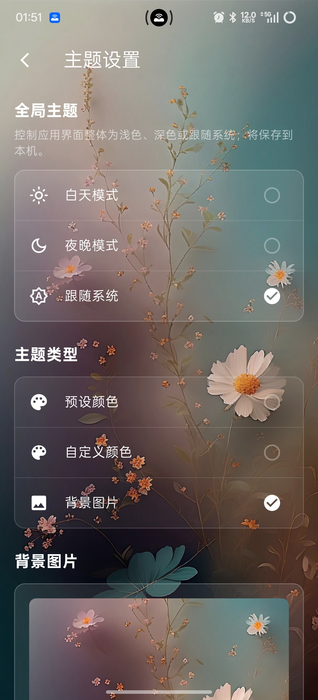
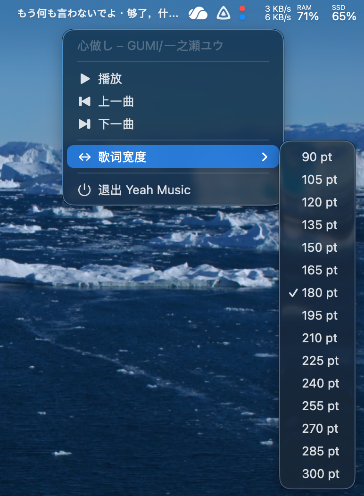

    

简洁、现代化的跨平台音乐播放器

# Yeah Music 🎶

**Yeah Music** 是一个基于 **Flutter** 开发的跨平台音乐应用，基于我个人使用场景而开发的本地音乐播放器，完全免费，不设置任何VIP或者付费解锁的功能，希望也能帮到同样喜欢本地音乐的你。

---

## ✨ 功能特性

### 🎶 本地音乐支持
- 扫描本地文件夹（支持多目录）
- 支持的音频格式：mp3 / flac / wav  / m4a
- 自动读取 ID3 / FLAC 标签
- 自动加载内嵌的 LRC 歌词
- 自动提取内嵌的封面

### 🖼️ UI 美化

- **自定义 App 背景**
    - 支持纯色背景
    - 支持渐变背景（线性 / 径向）
    - 支持自定义图片背景（本地图片）
    - 支持透明度与模糊调节
- **自定义播放页歌词**
    - 支持多种歌词模式（译文，最多10种语言，判断规则是同一时间戳存在的歌词行数）
    - 支持歌词渲染色（主色 / 渐变色 / 自定义色）
    - 支持字体大小、行距、对齐方式调整
    - 支持歌词高亮

### ☁️ Onedrive云端

- 浏览个人云盘目录树、看音频文件

- 点播与本地缓存

- 下载队列与批量操作

- 上传到云端

- 云同步 / 备份与恢复

- 与曲库的关系
  缓存目录可被合并进 **本地曲库扫描**（与 `PlayListProvider` 的 OneDrive 叠加逻辑配合），这样迷你条、最近播放、统计等与本地歌一致对待。

### 🖥️ 跨平台支持

- Android
- macOS
- Linux（KDE / GNOME）

> Windows暂时不支持，而上架iOS似乎收费（我不确定），由于我好几年没有用Windows了，所以预估很长一段时间内不会有Win版本，未来可能加入（我也不确定）。上面支持的这三个系统，都是我目前使用的主力系统。

## 📊 主要功能 & 各平台适配情况

> 色标说明：
>
> - 🟢  功能支持，经测试基本稳定可用
> - 🟡  包含此功能但是不稳定，可能无法达到预期状态
> - 🔴  不可用

| 功能 / 平台          | Android | macOS | Linux（KDE / GNOME） |
| -------------------- | ------- | ----- | -------------------- |
| 本地音乐管理         | 🟢       | 🟢     | 🟢                    |
| Onedrive 云端        | 🟢       | 🟡     | 🔴                    |
| 播放队列 / 播放模式  | 🟢       | 🟢     | 🟢                    |
| 封面 / 歌词 / 菜单栏 | 🟡       | 🟢     | 🟡                    |
| 全局 UI 定制         | 🟢       | 🟢     | 🟢                    |
| 元信息管理           | 🟢       | 🟡     | 🟡                    |
|                      |         |       |                      |

## ⭐ Star / Fork / Issue

如果你喜欢这个项目：

- **点个 Star ⭐**
- **Fork 一份随便玩，实现自己的 DIY 风格**
- **提 Issue 交流一下**

## 📄 许可证（License）

**Yeah Music** 使用 **GPL-3.0 License** 开源协议。**和 [Dynamic-SQL2](https://github.com/pengweizhong/dynamic-sql2) 项目不同，并不是 MIT 协议**。

这意味着：

- 你可以自由使用、修改、分发本项目
- 你可以基于本项目创建衍生作品
- 但所有衍生作品必须继续使用 **GPL-3.0** 协议开源
- 必须保留原作者的版权声明与协议说明

## APP 效果预览

### Andorid

  
  
  
  
  

### macOS

### KDE 