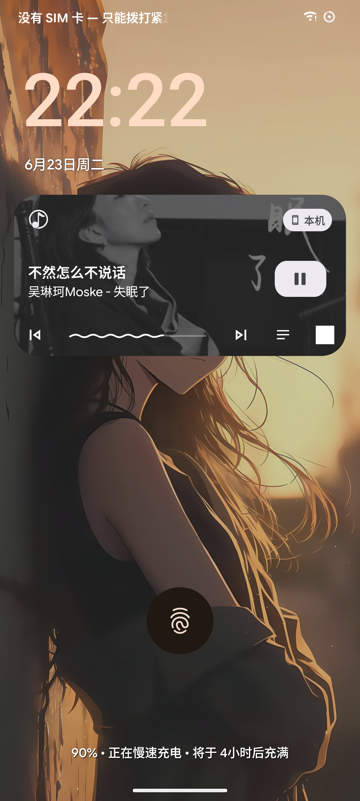
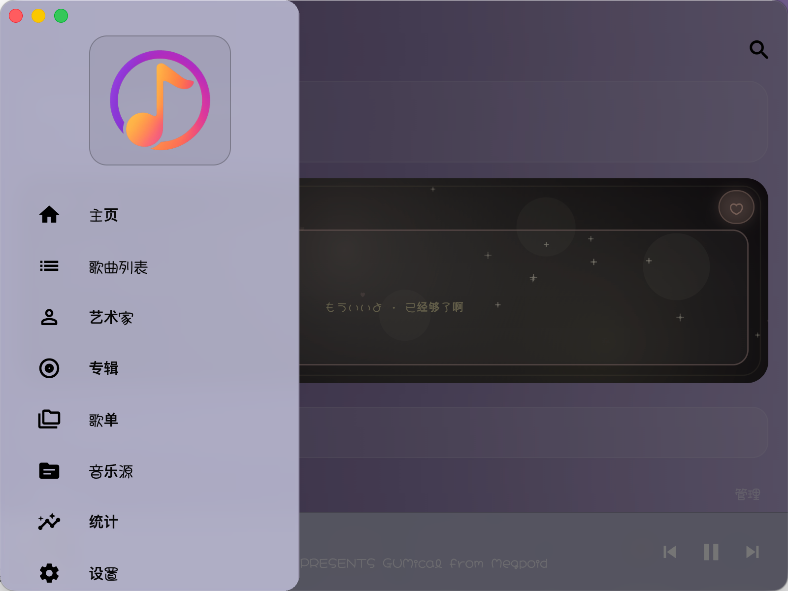
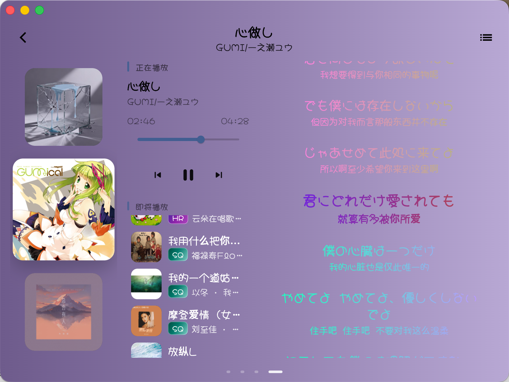
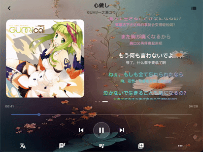
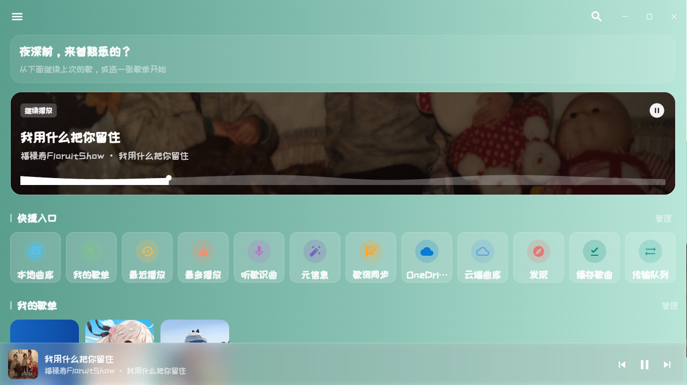
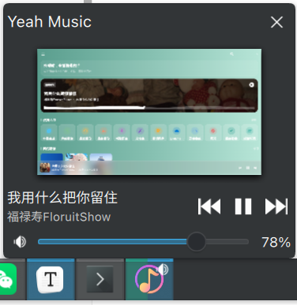
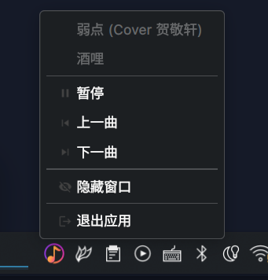

    

简洁、现代化的跨平台音乐播放器

# Yeah Music 🎶

**Yeah Music** 是一个基于 **Flutter** 开发的跨平台音乐应用，基于我个人使用场景而开发的本地音乐播放器，完全免费，不设置任何VIP或者付费解锁的功能，希望也能为同样喜欢本地音乐的你带来纯粹、轻松的使用体验。

> 补充：  
> 从 `2.0.0` 版本开始，因为一些原因（非技术原因），无法继续公开源码，本仓库只做发包使用；  
> 所发布的 `lite` 公开版本，绿色安全，可以放心使用；  
> 如不信任或不慎安装该APP，卸载即可；  
> 本仓库内源码，基本满足学习交流使用；
 

---

## 下载地址

GitHub Release（推荐）：https://github.com/pengweizhong/yeah_music/releases  
夸克网盘（备用）：https://pan.quark.cn/s/38af466474d0

## ✨ 功能特性

### 🎶 本地音乐入库

- 多目录扫描，本地音频一键纳入曲库
- 支持格式：`  mp3 / m4a  / wav / flac / opus / ogg `
- 支持多歌单，而且可以高度自定义
- 现代化的曲库统计

### 🧾 元信息管理

- 自动读取内嵌标签、封面与歌词等元信息（不支持外链歌词和封面）
- 支持编辑内嵌标签与歌词相关信息
- 支持重新加载嵌入数据，修正元信息不同步/缺失的情况

### 📚 歌词体验

- 多行歌词/多翻译按同一时间戳自动渲染显示
- 三种状态颜色/渐变区分：正在播放 / 已播过 / 未播到
- 可调字体大小、行距、对齐方式
- 歌词行可高亮并支持点击定位播放进度
- 支持在通知与车机场景显示歌词（并跟随你的歌词样式设置）

### 🖥️ 桌面歌词

- 悬浮歌词窗可拖动、可锁定位置
- 背景透明度可调
- 与播放页使用同一套歌词样式，统一歌词体验（颜色、多行模式、翻译等）
- 可设置当前行前后各显示多少条“按时间轴分段”的歌词

### 🎛️ 主题与 UI 美化

- 背景主题：纯色 / 自定义强调色 / 壁纸（把播放器变成你想要的界面，支持模块化）
- 自定义字体
- 支持渐变背景
- 壁纸可雾化与压暗，提高界面UI辨识度

### ☁️ Onedrive云端

- 云端曲库：索引网盘音乐文件夹，下载/删除、按需缓存、离线播放
- OneDrive 浏览器：浏览云盘目录，查看并播放音频
- 传输队列：批量上传 / 下载
- 本地上传：曲库多选或单曲上传至 OneDrive
- 云端备份：歌单与设置等按需同步，支持从云端恢复
- 缓存并入曲库：已落地文件与「音乐源」扫描结果合并为统一曲库

### 🖥️ 跨平台支持

- Android
- macOS
- Linux（KDE / GNOME）
- Windows（绿色便携版）

## 📊 主要功能 & 各平台适配情况
当前参照版本：`2.0.0`
> 色标说明：
>
> - 🟢  功能支持，经测试基本稳定可用
> - 🟡  包含此功能但是不稳定，可能无法达到预期状态
> - 🔴  不可用
>
> 对于不支持Onedrive的客户端，从 2.x 版本起，支持导入文件夹配置来实现间接同步的效果。

| 功能 / 平台           | Android | macOS | Windows | Linux（KDE / GNOME） |
| --------------------- | ------- | ----- | ------- | -------------------- |
| 本地音乐              | 🟢       | 🟢     | 🟢       | 🟢                    |
| 在线音乐              | 🟢       | 🟢     | 🟢       | 🟢                    |
| Onedrive 云端         | 🟢       | 🟢     | 🔴       | 🔴                    |
| 线控 / 键控           | 🟢       | 🟢     | 🟢       | 🟢                    |
| 封面 / 歌词 / 菜单栏  | 🟢       | 🟢     | 🟢       | 🟢                    |
| 全局 UI 定制 / 个性化 | 🟢       | 🟢     | 🟢       | 🟢                    |
| 元信息管理            | 🟢       | 🟢     | 🟢       | 🟢                    |
| 其他功能              | 🟢       | 🟢     | 🟡       | 🟡                    |

## ⭐ Star / Fork / Issue

如果你喜欢这个项目：

- **点个 Star ⭐**
- **Fork 一份随便玩，实现自己的 DIY 风格**
- **提 Issue 交流一下**

## 📄 许可证（License）

**Yeah Music** 使用 **GPL-3.0 License** 开源协议。**和 [Dynamic-SQL2](https://github.com/pengweizhong/dynamic-sql2) 项目不同，并不是 MIT 协议**。

这意味着：

- 你可以自由使用、修改、分发本项目
- 你可以基于本项目创建衍生作品
- 但所有衍生作品必须继续使用 **GPL-3.0** 协议开源
- 必须保留原作者的版权声明与协议说明

## APP 效果预览（基于2.0.0版本）

### Andorid

  
  
  
  
  

安卓额外适配了横屏播放效果

### macOS

电脑端支持拓展第三、第四播放页

macOS额外适配了菜单栏歌词、桌面歌词和logo播放进度润色。  

支持切换多行歌词显示模式，最多支持切换10种语言（我认为够用了），切换后的歌词会实时同步到菜单栏歌词和桌面悬浮歌词。

### Linux

Linux 桌面下适配了托盘图标，其余的和macOS界面基本一致，但是无法使用Onedrive。

Ubuntu / KDE 下额外适配了logo播放进度润色和托盘区域。

  
  

### Windows

这个基本和Linux下是一样的，由于重点不在windows上面，没怎么测试，只是顺手打了个包，目前来看可以满足基本的使用。